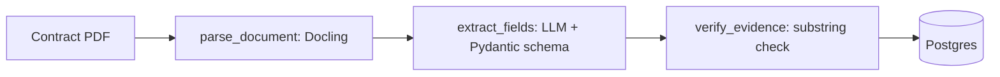

# clauseflow

Turns contract PDFs into structured records where **every extracted value
carries a verbatim quote from the source document** — and anything the
pipeline can't quote is reported missing rather than guessed.


## The problem

"The governing law is Delaware" is only useful if you can check it. An LLM
reading a 40-page contract will produce confident field values either way, and
the failure mode that matters isn't a wrong answer — it's a wrong answer that
looks exactly like a right one.

clauseflow makes every extracted field cite the sentence it came from, then
**mechanically verifies that sentence actually appears in the document**. A
quote that isn't really in the text means the value is dropped. Not flagged,
not scored low — dropped.

That check is a substring test, not a judgment call: either the quote is in the
contract or it isn't. There's nothing for a model to argue with.

## Fields extracted

| Field | |
|---|---|
| Document Name | Effective Date |
| Parties | Expiration Date |
| Governing Law | |

## Architecture



Docling handles the PDF (layout model + OCR, so scanned contracts work too),
a Pydantic schema constrains what the model may return, and the verification
step is plain Python. Full write-up in
[docs/architecture.md](docs/architecture.md).

This is the same evidence rule as
[jobpilot](https://github.com/HariSankar27/jobpilot)'s resume verifier, applied
to a completely different domain — contracts instead of career history.

## Quickstart

```bash
cp .env.example .env          # add GOOGLE_API_KEY
make up                       # Postgres via docker compose
make migrate                  # alembic upgrade head
uv run clauseflow extract evals/datasets/contracts/pdf/<any>.pdf
```

Output marks each field as found-with-evidence or missing:

```
[OK] Governing Law: State of New York
         evidence: "This Agreement shall be governed by the laws of the State of New York"
[MISSING] Expiration Date
```

## Results

Generated by `make eval` — never typed by hand. The table is empty because
**this suite has not been run yet**: it needs a real API key, which wasn't
available in the environment this was built in.

<!-- eval-results:start -->
| Metric | Value | Model | Dataset | Trials | Date |
|--------|-------|-------|---------|--------|------|
<!-- eval-results:end -->

Scoring counts a hit when the predicted value and the ground-truth span
overlap in either direction — exact string match is too strict for free-text
span annotations.

## The eval dataset is real

`evals/datasets/contracts/` holds **7 genuine commercial contracts** (public
SEC filing exhibits) and their expert clause annotations from the
[Contract Understanding Atticus Dataset (CUAD) v1](https://huggingface.co/datasets/theatticusproject/cuad),
© The Atticus Project, licensed **CC-BY-4.0**.

Two honest caveats about that number:

- It's a **curated 7-contract subset** of CUAD's 510, and the 5 fields were
  chosen *because* they're populated in all 7. That makes it a clean signal,
  not a representative benchmark — so results say "CUAD v1 subset (7
  contracts)", never a bare "CUAD score". See
  [docs/decisions/0001](docs/decisions/0001-cuad-subset-not-full-dataset.md).
- The full CUAD JSON is 40MB and isn't committed; only the filtered
  annotations for these 7 contracts are.

## Project status

| Area | State |
|---|---|
| Docling parsing, extraction graph, evidence check, Postgres | Built, 13 tests passing |
| End-to-end pipeline on a real contract PDF | **Verified** — the test suite parses an actual CUAD PDF with Docling and confirms a hallucinated quote gets dropped |
| Eval harness + CUAD subset | Built; **not yet run** (needs an API key) |
| Postgres-backed tests | Written; **not yet run** (needs Docker) |
| Self-correction, confidence routing, review queue, chunking | Not built (M4–M6) |

## Safety and limitations

- **Long contracts are truncated, not chunked.** Documents over
  `MAX_DOCUMENT_CHARS` (default 120k) have their tail dropped with a logged
  warning. Fields stated only in that tail come back *missing* — incomplete,
  but never fabricated. Chunking is M4.
- The evidence check confirms a quote exists in the document. It does not
  confirm the quote actually *supports* the value — a real but irrelevant
  sentence would pass. That's what the confidence routing in M4 is for.
- First run downloads Docling's layout/OCR models (~hundreds of MB, cached
  afterwards), so it needs network access once.
- Extraction quality is unmeasured until `make eval` runs. Treat output as a
  draft for review, not a system of record.

## License

MIT for the code. The eval dataset is CC-BY-4.0 — see above.
