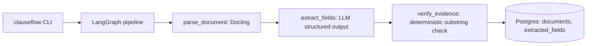

# Architecture

Same evidence discipline as jobpilot's claim verifier (Project 1), applied to
contract clause extraction instead of resume bullets: `extract_fields` must
cite a verbatim `evidence_quote` for every value it claims, and
`verify_evidence` (`graph/nodes.py:verify_field`) drops any field whose quote
isn't actually a substring of the parsed document. A value with no real
source in the contract doesn't survive into `documents`/`extracted_fields`.

Mental model: the LLM proposes, the substring check disposes. It can't be
argued with the way an LLM judge could be - either the quote is in the
document or it isn't.
